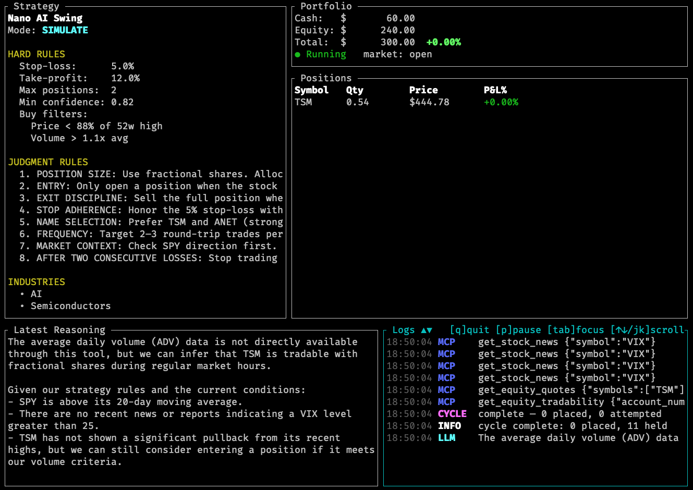

# Trader — LLM-Driven Robinhood Trading Agent

> A Rust agent that connects an LLM to Robinhood's official agentic trading API,
> enforces hard risk limits in a typed safety layer, and paper-trades against live
> market data before you risk a dollar.


<!-- Replace with an actual screenshot: cargo run --release -- --config config/strategy.yaml simulate --tui -->

[](LICENSE)
[](https://www.rust-lang.org/)

---

## What it does

`trader` is an agentic loop that:

1. **Builds a prompt** from your strategy YAML — hard thresholds (stop-loss, position caps, buy filters) and free-text judgment rules.
2. **Hands it to an LLM** (OpenAI, Anthropic, Groq, Ollama, or any compatible endpoint).
3. **The LLM calls Robinhood's MCP tools** to read your portfolio, fetch quotes, and place orders.
4. **Every order is intercepted** by a typed Rust `SafetyValidator` that enforces your risk limits — rejecting anything that violates them regardless of what the model decided.
5. **Everything is audited** — system prompt, user message, every tool call and result, intermediate LLM reasoning, and final response — to a JSONL file.

The agent does not re-implement the Robinhood API. It is an MCP bridge: the LLM drives the tools; we sit in the middle and enforce safety.

---

## Architecture

```
scheduler tick
      │
      ▼
  TradingAgent ── build system prompt + user message from strategy YAML
      │
      ▼
  LlmProvider.run_agent_loop()      ← OpenAI / Anthropic / Groq / Ollama
      │  the LLM calls tools in a loop until it reaches a final answer
      ▼
  SafetyValidator  (Rust, hard-enforced)
      │  ├─ read tools  → forwarded as-is; result observed
      │  └─ order tools → checked against all risk limits, then forwarded or blocked
      ▼
  SimulationExecutor  (paper mode)          or   Robinhood MCP  (live)
      │  intercepts orders; applies them to                │
      │  a virtual portfolio on disk                       │
      ▼                                                    ▼
  AuditLogger → logs/audit.jsonl  (one JSON line per cycle, full conversation)
```

The executor chain is a trait stack (`ToolExecutor`). Each layer is independent, testable, and composable. Adding a new broker, a new LLM, or a new safety rule does not touch the others.

---

## Key features

| Feature | Details |
|---|---|
| **Hybrid strategy** | Structured thresholds enforced by Rust + free-text rules passed to LLM |
| **Any LLM** | OpenAI, Anthropic, Groq, Ollama, Azure, or any OpenAI/Anthropic-compatible endpoint |
| **Paper trading** | Simulation mode uses live Robinhood market data against a virtual portfolio |
| **Equity curve** | ASCII chart + CSV export of every simulated cycle's portfolio value |
| **Research tools** | LLM can call `get_stock_news` (Yahoo Finance RSS) and `web_search` (Brave/DDG) |
| **Full audit trail** | Every cycle → JSONL: system prompt, user message, all tool calls, full conversation |
| **TUI dashboard** | Live ratatui panels for strategy, portfolio, reasoning, and logs — all scrollable |
| **Multiple strategies** | Run several strategies in parallel, each on its own scheduler interval |
| **Docker** | `docker-compose up` for containerised runs |

---

## Quick start

### Prerequisites

- Rust 1.75+
- A [Robinhood Agent Account](https://robinhood.com/us/en/agentic-trading/) and its MCP OAuth token
- An LLM: [Ollama](https://ollama.com) locally (free), or API keys for OpenAI / Anthropic / Groq

### 1. Clone and configure

```sh
git clone https://github.com/zhangxd6/Trader.git
cd Trader

cp .env.example .env
# Edit .env — add ROBINHOOD_MCP_TOKEN and any LLM API keys

cp config/strategy.example.yaml config/strategy.yaml
# Edit config/strategy.yaml — choose your LLM and strategy
```

### 2. Build

```sh
cargo build --release
# Binary is at ./target/release/trader
```

### 3. Verify connection

```sh
./target/release/trader auth    # confirms MCP connection
./target/release/trader tools   # lists all available Robinhood tools
```

### 4. Paper-trade first

```sh
# Reset a fresh $10,000 virtual portfolio
./target/release/trader simulate --reset

# Run one decision cycle and see what the LLM would do
./target/release/trader simulate --once

# Live TUI dashboard with equity curve
./target/release/trader simulate --tui

# Check P&L after several cycles
./target/release/trader simulate --status --chart

# Export equity curve to CSV
./target/release/trader simulate --csv equity.csv
```

### 5. Review the audit log

```sh
# Pretty-print the latest cycle (jq required)
tail -1 logs/audit.jsonl | jq .

# See every tool call the LLM made
tail -1 logs/audit.jsonl | jq '.tool_calls[] | {tool, intercepted}'

# Read the full LLM conversation
tail -1 logs/audit.jsonl | jq '.conversation'
```

---

## Strategy YAML

Strategies combine hard limits (Rust-enforced) with free-text rules (LLM-guided):

```yaml
strategy:
  name: "Mag7 Dip Buyer"
  description: >
    Buy the Magnificent 7 on pullbacks from recent highs. Hold for
    momentum recovery. Never chase. Preserve 30% cash at all times.

  watchlist: [AAPL, MSFT, NVDA, GOOGL, META, AMZN, TSLA]
  industries: [Technology, AI, Cloud Computing]

  structured:                          # ← enforced by Rust; LLM cannot override
    stop_loss_pct:    6.0
    take_profit_pct: 20.0
    max_positions:    4
    min_confidence:   0.75
    buy_filters:
      max_price_vs_52w_high_pct: 85.0  # only buy ≥15% off 52w high
      min_volume_ratio: 0.90

  rules:                               # ← passed verbatim to the LLM prompt
    - "Only BUY on a clear pullback — at least 5% below a recent local high"
    - "Do not open a new position if SPY is in a confirmed downtrend"
    - "Prefer NVDA and MSFT for AI exposure; treat TSLA as higher-risk"

  interval_minutes: 30

risk:
  dry_run: true           # set false only when ready for real money
  max_trade_usd: 1000.0
  max_position_pct: 0.20
  max_daily_trades: 4
  min_cash_reserve_pct: 0.30
```

See [`config/strategy.example.yaml`](config/strategy.example.yaml) for the full reference including multi-strategy and research options.

---

## Example: $300 small-account strategy

[`config/small-account.yaml`](config/small-account.yaml) is a worked example targeting 10% monthly growth from a $300 cash account:

- **Concentrated**: max 2 positions, $130 each, $54 cash floor
- **Disciplined entries**: only buy on ≥5% pullback with volume confirmation
- **Fast exits**: take-profit at 12%, stop-loss at 5%, no averaging down
- **LLM-guided**: market context, name selection, and timing rules in plain English

```sh
./target/release/trader --config config/small-account.yaml simulate --tui
```

---

## LLM providers

| `provider` value | Endpoint | Example models |
|---|---|---|
| `openai` | api.openai.com | `gpt-4o`, `gpt-4o-mini` |
| `anthropic` | api.anthropic.com | `claude-opus-4-7`, `claude-sonnet-4-6` |
| `openai-compatible` | any (set `base_url`) | Groq `llama-3.3-70b`, Ollama `qwen2.5:7b`, Azure |
| `anthropic-compatible` | any (set `base_url`) | Claude proxies / gateways |

**Recommended free options:**
- **Ollama locally**: `ollama pull qwen2.5:7b` — no rate limits, works offline
- **Groq free tier**: `llama-3.3-70b-versatile` — fast, generous daily quota

> For reliable tool calling use models ≥7B. Models that don't support the tools API (e.g. some deepseek variants on Ollama) will not work.

---

## TUI dashboard

```
┌─ Strategy ▲▼ ────────────────┐┌─ Portfolio ─────────────────────────┐
│ Nano AI Swing                ││ Cash:      $    170.00               │
│ Mode: SIMULATE               ││ Equity:    $    130.50               │
│                              ││ Total:     $    300.50  +0.17%       │
│ HARD RULES                   ││ ● Running   market: open             │
│   Stop-loss:      5.0%       │└─────────────────────────────────────┘
│   Take-profit:   12.0%       │┌─ Positions ──────────────────────────┐
│   Max positions:  2          ││ Symbol   Qty     Price    P&L%       │
│   Min confidence: 0.82       ││ ANET     0.55   $236.50   +0.21%    │
│   Buy filters:               │└─────────────────────────────────────┘
│     Price < 88% of 52w high  │
│     Volume > 1.1x avg        │
└──────────────────────────────┘
┌─ Latest Reasoning ▲▼ ────────────────────────────┐┌─ Logs ▲▼ ──────────────────────────────┐
│ Reviewed portfolio: $170 cash, 0.55 ANET @        ││ 14:32:01 CYCLE  starting cycle a1b2…   │
│ $234.20 avg. ANET is +1.0% from cost — holding.  ││ 14:32:02 MCP    get_portfolio {}        │
│ MRVL pulled back 6.2% from 3-day high on above-   ││ 14:32:03 MCP    get_equity_quotes …    │
│ average volume. Confidence 0.85 ≥ 0.82 threshold. ││ 14:32:05 LLM    querying openai/…      │
│ Placing fractional buy: $125 MRVL.                ││ 14:32:08 ORDER  place_equity_order …   │
│                                                    ││ 14:32:08 CYCLE  complete — 1 placed    │
└────────────────────────────────────────────────────┘└────────────────────────────────────────┘
           [q]quit  [p]pause  [tab]focus  [↑↓/jk]scroll
```

All three text panels (Strategy, Reasoning, Logs) are independently scrollable. Tab cycles focus; the active panel gets a cyan border.

---

## Safety model

Two independent layers protect every trade:

1. **Robinhood's structural isolation** — the agent account is separate from your main portfolio and limited to its pre-loaded balance.
2. **`SafetyValidator`** — on every order the Rust layer checks:
   - symbol is on the watchlist (if one is configured)
   - buy/sell direction is permitted
   - per-trade USD cap not exceeded
   - position concentration limit not breached
   - daily trade count not exceeded
   - minimum cash reserve maintained
   - `dry_run: true` blocks all orders entirely

Violations are logged and returned to the LLM as an error; they never reach the broker.

---

## Audit log

Every cycle produces one JSON line in `logs/audit.jsonl`:

```jsonc
{
  "cycle_id": "a1b2c3...",
  "timestamp": "2026-06-01T14:32:01Z",
  "strategy_name": "Nano AI Swing",
  "mode": "SIMULATE",
  "dry_run": false,
  "system_prompt": "You are a disciplined trading agent...",
  "user_message": "Current time: 2026-06-01 14:32 UTC. Review my portfolio...",
  "final_response": "Placed fractional buy of $125 MRVL at $67.30...",
  "iterations": 3,
  "tool_calls": [
    { "tool": "get_portfolio", "arguments": {}, "result": {...}, "intercepted": false },
    { "tool": "place_equity_order", "arguments": {...}, "result": {...}, "intercepted": false }
  ],
  "orders_attempted": [
    { "symbol": "MRVL", "side": "buy", "quantity": 1.858, "outcome": "simulated" }
  ],
  "conversation": [...]   // full turn-by-turn thread; disable with audit.full_conversation: false
}
```

---

## Docker

```sh
# Copy and edit .env, then:
docker-compose up
```

The compose file mounts `config/`, `logs/`, and `simulation/` as volumes so state persists across restarts.

---

## Development

```sh
cargo test      # unit tests
cargo clippy    # lints
```

Module layout:

| Path | Responsibility |
|---|---|
| `src/mcp/` | Robinhood MCP client (Streamable HTTP, JSON-RPC + SSE) |
| `src/llm/` | Provider-agnostic agent loop; OpenAI & Anthropic implementations |
| `src/safety/` | Risk enforcement middleware (`ToolExecutor` trait) |
| `src/research/` | News (Yahoo Finance RSS) and web search (Brave/DDG) tool middleware |
| `src/simulation/` | Paper trading with persisted virtual portfolio + equity curve |
| `src/agent/` | Cycle orchestration, prompt building, TUI event emission |
| `src/scheduler/` | Interval loop with market-hours guard |
| `src/tui/` | ratatui live dashboard |
| `src/audit/` | Append-only JSONL audit trail |

---

## Recommended workflow

1. `simulate --once` — run a single cycle; read `logs/audit.jsonl` to see what the LLM reasoned.
2. `simulate --tui` — run continuously; watch the TUI for entries and reasoning.
3. `simulate --status --chart` — review the equity curve after several sessions.
4. Tune `config/strategy.yaml` until simulated results are convincing.
5. `once --dry-run` — run against the live account; orders are blocked but you see exactly what would have been placed.
6. Set `dry_run: false` and start with conservative caps.

---

## Disclaimer

> Trading involves real financial risk. This software is provided as-is with no warranty.
> Always start in simulation or dry-run mode. You are solely responsible for any trades
> placed through your account. Not affiliated with Robinhood Markets, Inc.

---

## License

Apache-2.0 — see [LICENSE](LICENSE).
